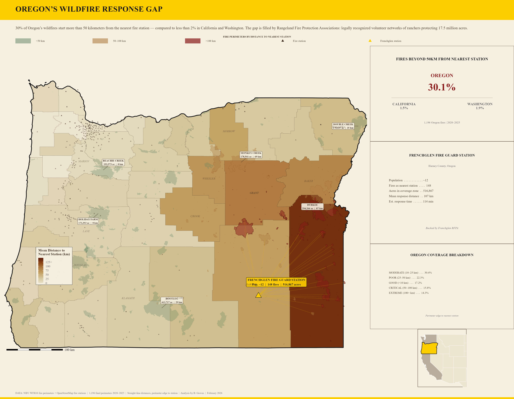
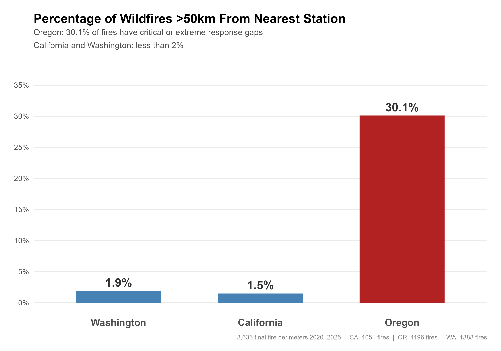
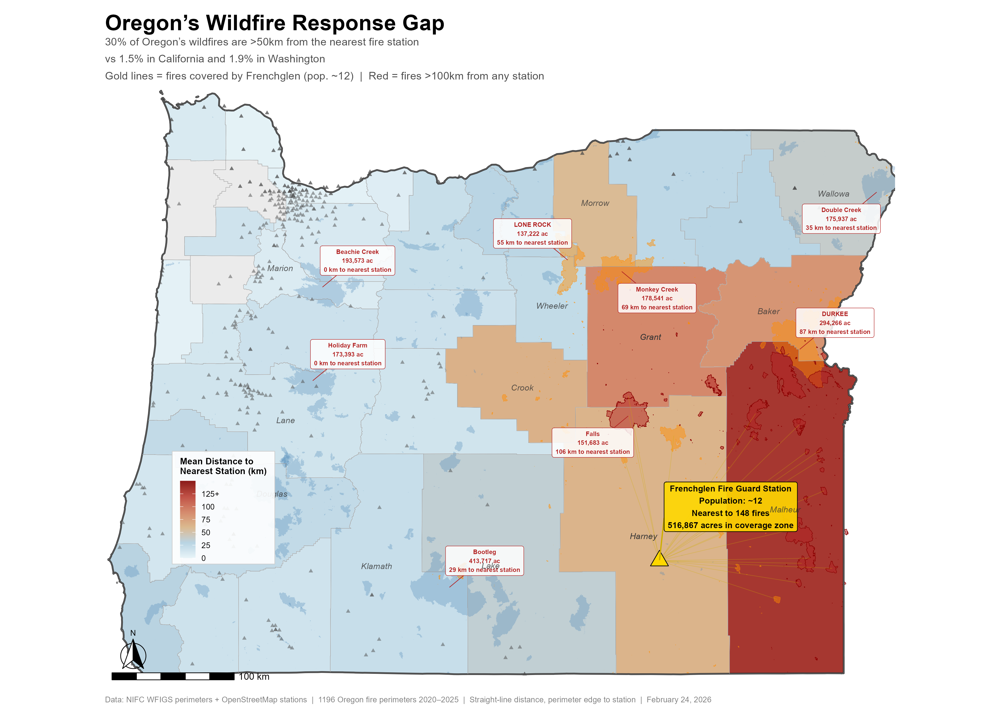
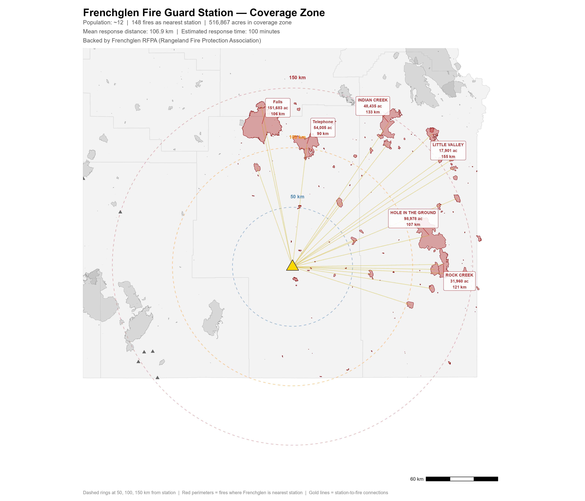
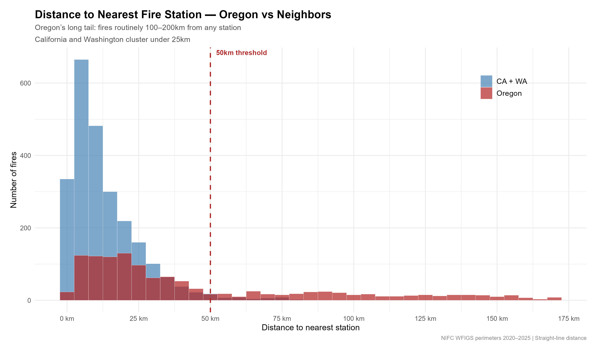
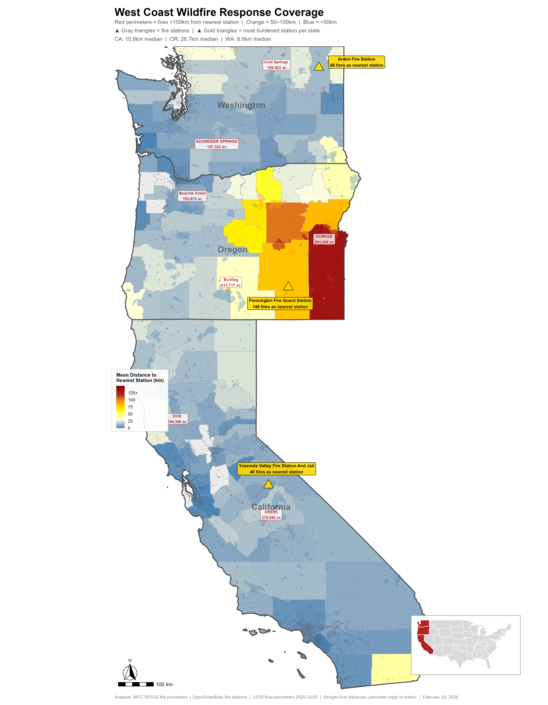
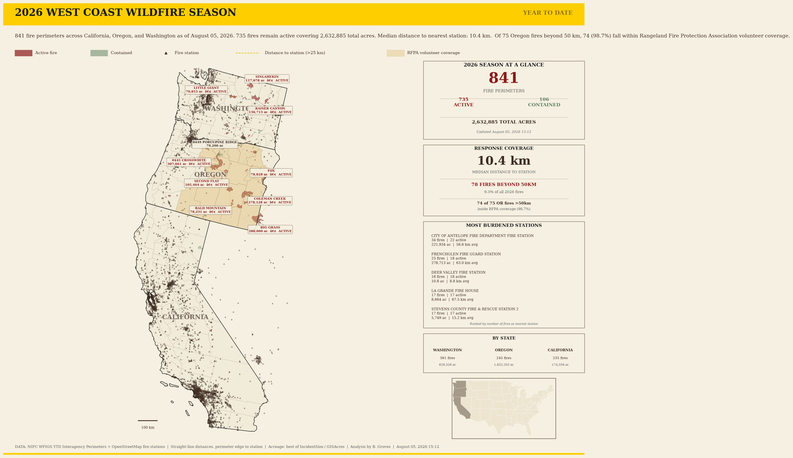

# 🔥 WILDFIRE RESPONSE GAP ANALYSIS

[](https://github.com/bdgroves/wildfire-response-gaps/commits/main)
[](https://bdgroves.github.io/wildfire-response-gaps/)
[](https://github.com/bdgroves/wildfire-response-gaps/actions/workflows/ytd_update.yml)
[](https://github.com/bdgroves/wildfire-response-gaps/actions/workflows/update_fire_map.yml)

---

> *"It's already on the ground."*

When a wildfire ignites in eastern Oregon, help isn't minutes away. It's hours. Sometimes it isn't coming at all — not from a mapped fire station. This project measures that gap across every wildfire perimeter on the West Coast, names the stations carrying the load, and tracks the 2026 season live.

---

## 🌐 [→ OPEN THE LIVE MAP](https://bdgroves.github.io/wildfire-response-gaps/)

Interactive Leaflet map. Fire perimeters updated every morning at 5am Pacific. Click any fire for distance to nearest station and estimated response time.

---



---

## THE FINDING THAT SURPRISED ME

I calculated the distance from every wildfire perimeter to the nearest fire station across three West Coast states. California and Washington looked normal. Oregon didn't.

| State | Fires | Median Distance | % Fires >50km |
|-------|-------|-----------------|---------------|
| Washington | 1,388 | 8.6 km | 1.9% |
| California | 1,051 | 10.8 km | 1.5% |
| **Oregon** | **1,196** | **26.7 km** | **30.1%** |

I checked the data twice. The pattern held.



---

## WHY OREGON IS DIFFERENT

Eastern Oregon is enormous, sparsely populated rangeland. The model that works in western Oregon, in California's populated corridors, in western Washington — it doesn't reach out there.

**Malheur County alone is 9,930 square miles** — larger than New Hampshire. Median fire-to-station distance: 139.1 km. Every single fire in the county is beyond 50km from any mapped station.

Oregon's answer: **Rangeland Fire Protection Associations (RFPAs).**

RFPAs are legally recognized volunteer networks — ranchers and landowners organized to protect over 17.5 million acres that have no existing state or local fire protection. This isn't informal mutual aid. It's codified in Oregon statute with defined authority and structure. **Oregon is the only state in the country with this formal structure.** No other western state has replicated it.



---

## FRENCHGLEN FIRE GUARD STATION



Frenchglen Fire Guard Station sits in Harney County — population approximately 12. It is the nearest mapped station to **148 wildfires** covering **516,867 acres**.

| Metric | Value |
|--------|-------|
| Fires as nearest station | 148 |
| Total acres in coverage zone | 516,867 |
| Mean distance to fires | 106.9 km |
| Mean estimated response time | 114 minutes |
| Largest fire | Falls Fire — 151,683 ac (2024) |

But Frenchglen isn't alone. It's one node in a network that includes the Frenchglen RFPA, BLM resources, and US Fish & Wildlife. The ranchers in these associations are often on scene **hours before federal resources arrive** — with fire-equipped trucks, slip-on water tanks, and generations of knowledge of this land.

The infrastructure gap is real. The people filling it are remarkable.

---

## THE DISTANCE DISTRIBUTION



California and Washington fires cluster under 25km. Oregon has a long tail stretching past 200km — not as outliers, but as the **norm for the eastern half of the state.**

---

## WEST COAST FULL PICTURE



Three states. 3,635 fire perimeters. One map. The contrast between Oregon's eastern half and everything else is visible at a glance.

---

## 🔥 2026 FIRE SEASON — LIVE YTD TRACKER

**[→ Open Interactive Map](https://bdgroves.github.io/wildfire-response-gaps/)**

Updated automatically every morning at 5am Pacific. Python fetches fresh perimeters from the NIFC WFIGS API, recomputes distances to the nearest fire station, and commits a GeoJSON to this repo. The R workflow runs at 6am and rebuilds the NatGeo-style PNG. No manual intervention required.



### How to read the map

| Symbol | Meaning |
|--------|---------|
| Red polygon | Active fire perimeter |
| Green polygon | Contained fire perimeter |
| ▲ Triangle | Fire station (OpenStreetMap) |
| Dashed line | Fire more than 25km from nearest station |
| Fire label | Top fires by acres — name, size, active status |

### What updates every morning

| What | Where |
|------|-------|
| Fire perimeter shapes | Main map |
| Fire count, active/contained split | Header + sidebar |
| Total acres | Header + subtitle |
| Median distance to nearest station | Coverage panel |
| Fires beyond 50km + percentage | Coverage panel + gap bar |
| Top 10 fire labels with acreage | Map callouts |
| Connector lines to distant stations | Dashed lines on map |
| Timestamp | Caption bar + sidebar |

### Season stages

| Stage | Fire Count | When | What you'll see |
|-------|-----------|------|-----------------|
| Pre-season | 0 | Feb–May | Stations only — ready and waiting |
| Early | < 10 | May–Jun | First perimeters, gap lines emerging |
| Building | 10–49 | Jun–Jul | Coverage picture taking shape |
| Peak | 50+ | Jul–Oct | Full gap exposure — Oregon vs CA/WA contrast at maximum |

### What peak season will look like

By July and August, when Oregon's rangeland fires are running, the map will surface the same structural gaps documented in the historical analysis — Malheur and Harney counties with median distances exceeding 100km, Frenchglen Fire Guard Station as the nearest station to dozens of active fires, and the RFPA volunteer network as the primary response mechanism for millions of acres.

---

## RUN LOCALLY

```bash
# Refresh the interactive map GeoJSON
python python/fetch_fires.py

# Rebuild the NatGeo static map (requires R + dependencies)
source("R/19_ytd_natgeo.R")
```

---

## DATA & METHODS

| Source | Used for |
|--------|----------|
| [NIFC WFIGS API](https://data-nifc.opendata.arcgis.com/) | Fire perimeters (historical + YTD) |
| [OpenStreetMap](https://www.openstreetmap.org/) | Fire station locations |
| [US Census TIGER](https://www.census.gov/geographies/mapping-files/time-series/geo/tiger-line-file.html) | County + state boundaries |

- Distances are straight-line (haversine), perimeter edge to nearest station
- Acreage: best available of `IncidentSize` or `GISAcres`
- Active = `PercentContained` is null or < 100

---

## REPO STRUCTURE

```
wildfire-response-gaps/
├── index.html                    # Live interactive Leaflet map
├── python/
│   └── fetch_fires.py            # Fetches WFIGS → writes output/fires.geojson
├── R/
│   ├── 01_setup.R
│   ├── 07–13_west_coast_*.R      # Historical analysis pipeline
│   ├── 19_ytd_natgeo.R           # NatGeo-style YTD map builder
│   └── update_ytd_ci.R           # GitHub Actions entrypoint for R
├── output/
│   ├── fires.geojson             # Live data for the web map (auto-updated)
│   └── figures/                  # Static PNG outputs
└── .github/workflows/
    ├── update_fire_map.yml        # Python: runs 5am Pacific daily
    └── update_ytd_map.yml         # R: runs 6am Pacific daily
```

---

*Built by [B. Groves](https://github.com/bdgroves) · Open source · MIT License*
